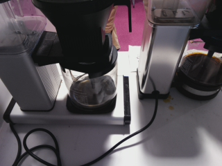
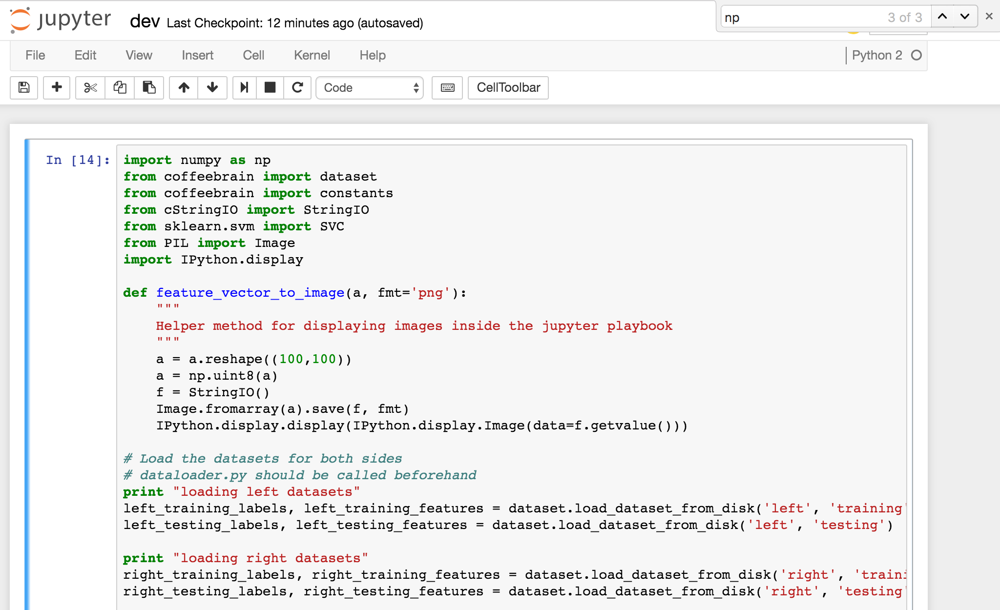
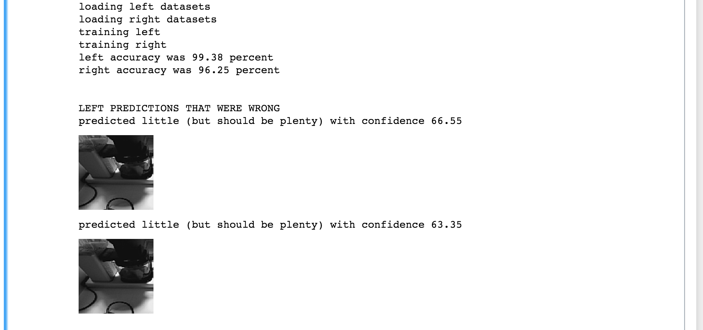

## CoffeeBrain

You can turn this




into this
```
{
  "left_pot": "empty",
  "right_pot": "little"
}
```

## How to install
pip install -r requirements.txt

## How to fetch data
Get your labeled dataset in CSV format.
CSV format is: `imageurl,left_label,right_label`

When you have yours CSV then run `python dataloader <dataset.csv>` and enjoy. The dataset is split into testing and training data onload.

## How to generate new models
- First fetch data. See above.
- `python generate_models.py` generates two classifiers. One for each side.
- Classifiers are serialized to `classifiers/`

## How to run the predictor web server
- First fetch data. See above.
- Then generate models. See above.
- Then run `python web.py` and your server should be running.
- Predictor is listening at endpoint `/predict`

How to get a prediction
Request
```
curl -X POST -H "Content-Type: application/json"  -d '{"image_url":"https://s3.eu-central-1.amazonaws.com:443/coffee-pot/media/snapshots/2016-10-14/2016-10-14_07.49.09.899294.jpg"}' http://localhost:5000/predict/
```
Response
```
{
  "left_pot": "empty",
  "right_pot": "little"
}
```
You can request prediction from with

## How to develop
- First fetch data. See above
- run `jupyter notebook` and load the `dev` notebook
- Fiddle with the code as you wish

Fiddle with code


See results


## I want different images to my training and testing data
- Remove directories `training_data` and `testing_data`
- run `dataloader.py <dataset.csv>`. It will not redownload any new data but will random new datasets from the existing files
